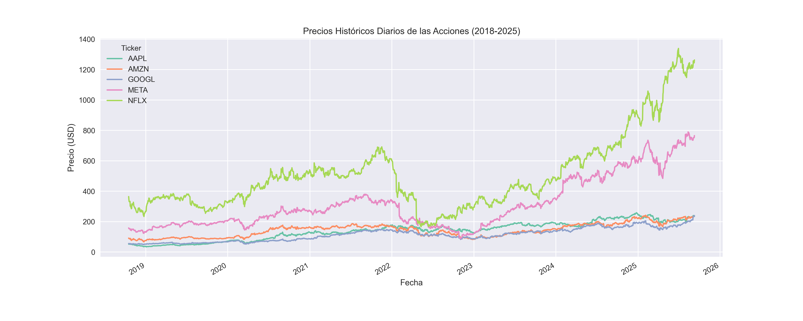

# Análisis Financiero de FAANG con Yahoo Finance

Este proyecto forma parte de un portafolio de análisis de datos en GitHub. 
Se enfoca en el análisis financiero de las principales empresas tecnológicas FAANG (Facebook, Amazon, Apple, Netflix, Google).

## Contenido

1. **Obtención de datos**: Descarga de datos de Yahoo Finance usando la librería `yfinance`.
2. **Análisis exploratorio**: Visualización de precios históricos y rendimientos.
3. **Métricas financieras**: 
   - Rendimiento acumulado
   - Volatilidad anualizada
   - Correlación entre activos
   - Ratio de Sharpe
   - Drawdown máximo
   - Value at Risk (VaR)

## Requisitos

Instalar dependencias con:

```bash
pip install -r requirements.txt
```

## Uso

Ejecutar el notebook principal: Análisis Financiero con Yahoo Finance.ipynb

## Objetivo

El objetivo de este proyecto es aplicar herramientas de análisis de datos en un contexto financiero.
Se busca explorar desde la recolección y procesamiento de datos históricos hasta la generación de métricas cuantitativas que permitan entender el comportamiento de los activos.
Además de fortalecer habilidades técnicas en Python, este proyecto promueve la práctica de análisis exploratorio, visualización, manejo de riesgos y comparación de activos.
En síntesis, funciona como un laboratorio personal para afianzar competencias en análisis de datos y su aplicación en el ámbito financiero.

## Imagenes


